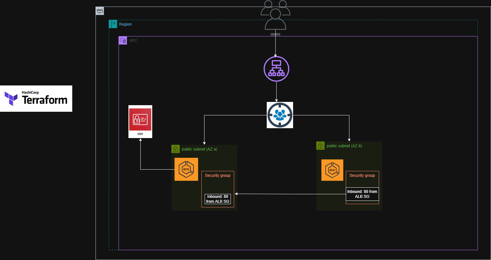
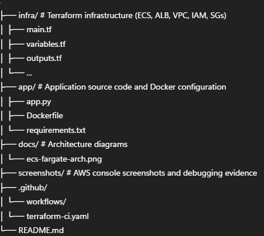

<p align="center">
  
  
  
  
  
  
</p>

# ECS Fargate with Application Load Balancer (Terraform)

## Overview

This project demonstrates deploying a containerised application on **AWS ECS using Fargate**, fronted by an **Application Load Balancer (ALB)** and fully provisioned using **Terraform**.

Rather than following a “happy path” tutorial, this project focuses on **real-world AWS infrastructure challenges**, including networking constraints, security group rules, target group behaviour, and debugging common production-style errors such as **503 Service Unavailable** and **502 Bad Gateway**.

The final result is a stable, production-style ECS service that successfully serves traffic via an ALB.

---

## Key Features 

### Infrastructure as Code (IaC)
- Entire AWS stack provisioned using **Terraform**
- Reproducible, version-controlled infrastructure
- Clean separation of Terraform resources across files

### ECS Fargate (Serverless Containers)
- No EC2 instance management
- Task definitions defined declaratively
- ECS Service maintains desired task count and health

### Application Load Balancer
- Public-facing ALB distributes traffic to ECS tasks
- Health checks ensure traffic is only routed to healthy containers
- Listener and target group managed via Terraform

### Secure Networking
- Security groups scoped to least privilege
- ALB allows inbound HTTP traffic
- ECS tasks only accept traffic from the ALB
- All resources aligned within the same VPC

### Multi–Availability Zone Design
- ALB deployed across multiple AZs
- Improved availability and resilience
- Follows AWS best practices

---

## Architecture

High-level request flow for the ECS Fargate service provisioned using Terraform.



### Request Flow
1. Users send HTTP requests to a public Application Load Balancer (ALB)
2. The ALB forwards traffic to an IP-based target group
3. Traffic is distributed across ECS tasks running on AWS Fargate
4. ECS tasks run across multiple Availability Zones for resilience

### Security Model
- ALB security group allows inbound HTTP traffic from the internet
- ECS task security group only allows inbound traffic from the ALB
- No direct public access to containers
- All resources are deployed within a single VPC

### High Availability
- ALB spans multiple Availability Zones
- ECS service maintains desired task count
- Failed tasks are automatically replaced


### Core Components
- VPC with public subnets
- Application Load Balancer
- IP-based Target Group
- ECS Cluster and ECS Service
- ECS Task Definition (Dockerised Flask application)
- Amazon ECR for container images
- IAM Execution Role
- Security Groups

---

## CI/CD Pipeline

This project includes a fully automated CI/CD pipeline implemented using GitHub Actions.

### Pipeline Capabilities
- Automatically builds Docker images on every push to `main`
- Pushes images to Amazon ECR
- Runs Terraform init and plan in CI
- Uses GitHub Secrets for secure AWS authentication
- No credentials are stored in the repository

### Why This Matters
- Infrastructure changes are validated automatically
- Application builds are reproducible
- Reduces manual deployment risk
- Reflects real-world DevOps workflows

---

## Terraform State

Terraform state is currently stored locally for learning purposes.
In a production environment, this would be stored in a remote backend
(e.g. S3 with DynamoDB state locking).

---

## Terraform Resources Used

- `aws_vpc`
- `aws_subnet`
- `aws_lb`
- `aws_lb_listener`
- `aws_lb_target_group`
- `aws_ecs_cluster`
- `aws_ecs_service`
- `aws_ecs_task_definition`
- `aws_iam_role`
- `aws_security_group`

Resources are organised across multiple `.tf` files for clarity and maintainability.

---

## Repository Structure

The project is organised by responsibility to clearly separate
infrastructure, application code, CI/CD, and documentation.





---

## Problems Encountered (Real-World Debugging)

During the build, several realistic infrastructure issues were encountered:

### ❌ 503 Service Unavailable
- ALB was reachable but had no healthy targets
- ECS tasks were not ready to receive traffic

### ❌ 502 Bad Gateway
- Target group port did not match the container’s listening port
- ALB could reach the task, but the application response failed

### ❌ Target Group Replacement Errors
- AWS blocked deletion of target groups still attached to listeners
- Name collisions occurred during replacement attempts

### ❌ Image Pull Failures
- ECS tasks could not pull container images
- Caused by lack of outbound internet access

---

## How These Issues Were Fixed

- Aligned **ALB listener → target group → container ports**
- Switched container port to **80** to match nginx defaults
- Used `create_before_destroy` to safely rotate target groups
- Implemented `name_prefix` to avoid AWS naming conflicts
- Enabled public IP assignment for ECS tasks to allow image pulls
- Ensured VPC, subnets, and security groups were correctly aligned

These fixes reflect common troubleshooting steps used in real production environments.

---

## Improvements & Next Steps 🚀

### HTTPS
- Add ACM certificates
- Enable HTTPS listener on port 443
- Redirect HTTP → HTTPS

(This will be added as a follow-up once a domain is available.)


---

## How to Deploy

```bash
terraform init
terraform plan
terraform apply
